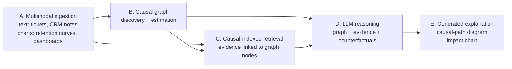

# casual-multimodal-rag-churn
<div align="center">

# Causal Multimodal RAG for Customer Retention

**Retrieve evidence across text and charts, reason about churn causally, and explain the answer with generated diagrams.**

> **Author:** Jiya Virpara · Atal Bihari Vajpayee Indian Institute of Information Technology and Management, Gwalior, India · jiya.virpara2116@gmail.com ·
> This is an independent research project in its early stage. The README states clearly what is done and what is planned (see [Status](#status)).

---

## 1. The problem

Churn models usually answer *"who will leave?"*, but retention teams need *"why, and what should we change?"*. Two gaps make this hard:

1. **Correlation is not cause.** A model that flags customers with slow support response can't tell you whether *fixing* response time would keep them.
2. **The evidence is multimodal.** The reasons for churn sit in support tickets and CRM notes (text) and in dashboards and retention curves (charts), but most retrieval systems index only text, and only by similarity to the query.

## 2. Idea

Index text and chart evidence **against the nodes and edges of a causal graph** of churn drivers, instead of against generic semantic similarity. Given a question such as *"Why is churn rising in month-to-month contracts, and what would reduce it?"* the system:

- retrieves evidence for a **specific causal edge** (for example `support_response_time → churn`),
- estimates the effect of an intervention with a structural causal model,
- returns a recommendation where **every claim is traceable** to a causal edge, a document or a chart region,
- **renders its own explanation**: a causal-path diagram and a before/after retention projection built from the live subgraph.

## 3. Architecture



| Stage | What it does | Candidate methods |
|---|---|---|
| **A. Ingestion** | Extracts entities and events from text; parses charts into underlying values | Small fine-tuned language model for tickets; DePlot/MatCha-style chart parsing |
| **B. Causal graph** | Learns a DAG over churn factors, estimates effects | PC algorithm, NOTEARS, DoWhy / causal-learn |
| **C. Retrieval** | Joint text-chart embedding space, indexed by causal node | CLIP-style dual encoder, ColPali-style page retrieval |
| **D. Reasoning** | Produces auditable recommendations with counterfactual estimates | LLM conditioned on subgraph, evidence and do-calculus estimates |
| **E. Visualization** | Draws the causal path and intervention impact from live data | matplotlib / Graphviz / SVG generation |

## 4. Research questions

- **RQ1.** Does indexing multimodal evidence by causal node improve retrieval precision compared with similarity-only retrieval?
- **RQ2.** Can a system's generated causal-path diagram be checked automatically for *faithfulness* to the causal path it actually used?
- **RQ3.** How reliable are chart-parsed values as inputs to causal estimation, compared with the underlying ground-truth data?

## 5. Related work and how this differs

| Work | What it does | Gap this project targets |
|---|---|---|
| **CausalRAG** (Wang et al., Findings of ACL 2025) | Uses causal graphs to improve text retrieval | Text only |
| **Causal-Counterfactual RAG** | Adds counterfactual reasoning over causal graphs in RAG | Text only, not churn-specific |
| **Multimodal graph RAG** (for example HVM-GraphRAG) | Retrieval over text, images and structured data with knowledge graphs | Graphs are associative, not causal |
| **Causal analysis of churn** (Rudd et al., arXiv 2304.10604) | Deep learning plus a causal Bayesian network for churn causes | No retrieval, no multimodal evidence, no generated explanations |
| **Multimodal explainable churn** (tabular + text, SHAP/LIME/DiCE) | Post-hoc explanations for churn predictions | Correlational; no causal graph or generated visuals |

I don't claim the components are new. The open question is whether **keying multimodal retrieval to a causal graph, and checking the faithfulness of the generated explanation**, adds measurable value. My literature search so far did not find a system combining all of these for churn, but the search is limited and ongoing.

## 6. Data plan

Real proprietary multimodal churn data is not public, so the proof of concept uses **synthetic-but-grounded data**:

- **Tabular base:** [Telco Customer Churn](https://www.kaggle.com/datasets/blastchar/telco-customer-churn) (Kaggle), giving a labelled churn target.
- **Synthetic causal ground truth:** a simulated dataset generated from a **known DAG**, so the learned graph can be scored exactly.
- **Synthetic text:** support-ticket and CRM-note text generated conditionally on the tabular features.
- **Synthetic charts:** matplotlib dashboards and retention curves rendered from the same data, so chart-parsing accuracy is measurable against known values.

**Limitation:** because the text and charts are generated from the same tables, results on this data show that the pipeline works, not that it generalizes to real business data. Any claims will be scoped accordingly.

## 7. Evaluation

| Component | Metric |
|---|---|
| Chart parser | Value-extraction error against known ground truth |
| Causal graph | Structural Hamming distance vs. the simulated DAG |
| Retrieval | Precision / recall of retrieved evidence vs. labelled relevance |
| Intervention estimates | Error against the simulated intervention effect |
| Generated diagrams | Faithfulness: does the rendered path match the path the system used (automated check) |

## 8. Status

- [x] Problem definition and architecture design
- [x] Initial literature review (causal RAG, multimodal RAG, causal churn analysis)
- [ ] Synthetic data generation (charts and tickets from Telco data)
- [ ] Causal graph learning on simulated data
- [ ] Baseline retrieval (similarity-only)
- [ ] Causal-indexed multimodal retrieval
- [ ] Faithfulness checker for generated diagrams
- [ ] Evaluation and write-up

**Scope note:** the full five-stage system is a long-term vision. The near-term goal is a minimal end-to-end prototype covering Stages B, C and E on synthetic data.

## 9. Repository structure (planned)

```
├── data/            # generated synthetic tables, charts, text
├── notebooks/       # data generation and exploration
├── src/             # causal graph, retrieval, rendering code
├── docs/            # literature notes and design decisions
└── README.md
```

## 10. References

1. Wang et al. *CausalRAG: Integrating Causal Graphs into Retrieval-Augmented Generation.* Findings of ACL, 2025. [arXiv:2503.19878](https://arxiv.org/abs/2503.19878)
2. Rudd, Huo, Xu. *Causal Analysis of Customer Churn Using Deep Learning.* [arXiv:2304.10604](https://arxiv.org/abs/2304.10604)
3. Pearl, J. *Causality: Models, Reasoning, and Inference.* Cambridge University Press, 2009.
4. Spirtes, Glymour, Scheines. *Causation, Prediction, and Search.* MIT Press, 2nd ed., 2000 (PC algorithm).
5. Zheng, Aragam, Ravikumar, Xing. *DAGs with NO TEARS: Continuous Optimization for Structure Learning.* NeurIPS 2018. [arXiv:1803.01422](https://arxiv.org/abs/1803.01422)
6. Liu et al. *DePlot: One-shot visual language reasoning by plot-to-table translation.* Findings of ACL, 2023. [arXiv:2212.10505](https://arxiv.org/abs/2212.10505)
7. Faysse et al. *ColPali: Efficient Document Retrieval with Vision Language Models.* ICLR 2025. [arXiv:2407.01449](https://arxiv.org/abs/2407.01449)

## 11. Contact

Feedback, pointers to related work and collaboration suggestions are welcome. Please open an issue or email jiya.virpara2116@gmail.com.
